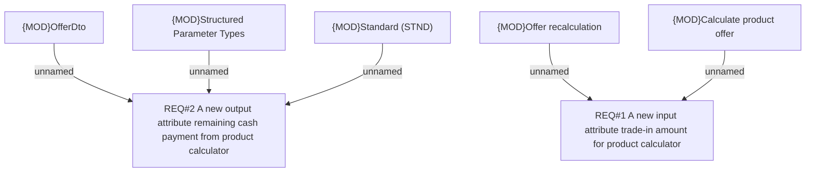

# PCG-5767 (BRPH-2797) Trade-In Amount as part of Down payment in BSL POC

- **Diagram Type**: Custom
- **Package**: HomerSelect/BSL/Requirements Model/Finished/PCG/PCG-5767 (BRPH-2797) Trade-In Amount as part of Down payment in BSL POC
- **Diagram ID**: 164649
- **Elements**: 7
- **Connectors**: 5

