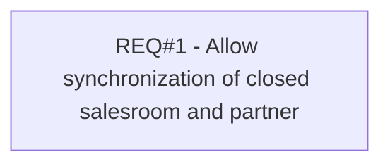

# PCG-598 Allow synchronization of Partner/Salesroom in status Closed (CBL-756)

```mermaid
graph TD
    REQ_1_Allow_synchronization_of_closed_salesroom_and_partner["REQ#1 - Allow synchronization of closed salesroom and partner"]
```
