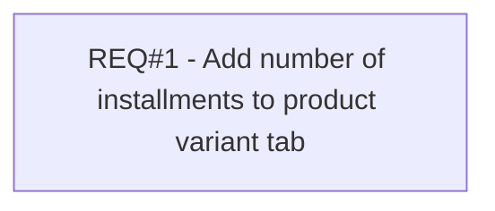

# PCG-600 Display Number of Installments in Product Variant Tab (CBL-1246)

- **Diagram Type**: Custom
- **Package**: HomerSelect/BSL/Requirements Model/Finished/PCG/PCG-600 Display Number of Installments in Product Variant Tab (CBL-1246)
- **Diagram ID**: 103324
- **Elements**: 1
- **Connectors**: 0

