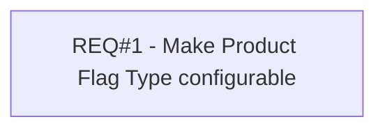

# PCG-603 Make Product Flag Type configurable

- **Diagram Type**: Custom
- **Package**: HomerSelect/BSL/Requirements Model/Finished/PCG/PCG-602 Internal Tasks 2018/PCG-603 Make Product Flag Type configurable
- **Diagram ID**: 93999
- **Elements**: 1
- **Connectors**: 0

