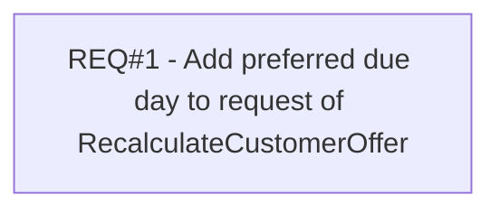

# PCG-611 Cards API for mobile - add Preferred Due Day to RecalculateCustomerOffer (CBL-620)

- **Diagram Type**: Custom
- **Package**: HomerSelect/BSL/Requirements Model/Finished/PCG/PCG-611 Cards API for mobile - add Preferred Due Day to RecalculateCustomerOffer (CBL-620)
- **Diagram ID**: 103326
- **Elements**: 1
- **Connectors**: 0

