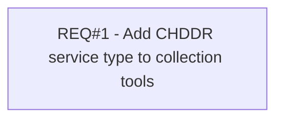

# PCG-614 CHDDR as a Part of Collection Tools (CBL-308)

- **Diagram Type**: Custom
- **Package**: HomerSelect/BSL/Requirements Model/Finished/PCG/PCG-614 CHDDR as a Part of Collection Tools (CBL-308)
- **Diagram ID**: 103344
- **Elements**: 1
- **Connectors**: 0

