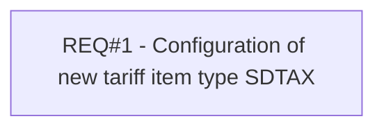

# PCG-69 Stamp duty fee REL Account (CBL-8)

- **Diagram Type**: Custom
- **Package**: HomerSelect/BSL/Requirements Model/Finished/PCG/PCG-69 Stamp duty fee REL Account (CBL-8)
- **Diagram ID**: 103141
- **Elements**: 1
- **Connectors**: 0

