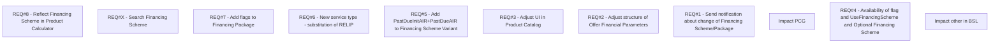

# PCG-701 Financing Schema II (CBL-1533)

```mermaid
graph TD
    REQ_8_Reflect_Financing_Scheme_in_Product_Calculator["REQ#8 - Reflect Financing Scheme in Product Calculator"]
    REQ_X_Search_Financing_Scheme["REQ#X - Search Financing Scheme"]
    REQ_7_Add_flags_to_Financing_Package["REQ#7 - Add flags to Financing Package"]
    REQ_6_New_service_type_substitution_of_RELIP["REQ#6 - New service type - substitution of RELIP"]
    REQ_5_Add_PastDueInitAIR_PastDueAIR_to_Financing_Scheme_Vari["REQ#5 - Add PastDueInitAIR+PastDueAIR to Financing Scheme Variant"]
    REQ_3_Adjust_UI_in_Product_Catalog["REQ#3 - Adjust UI in Product Catalog"]
    REQ_2_Adjust_structure_of_Offer_Financial_Parameters["REQ#2 - Adjust structure of Offer Financial Parameters "]
    REQ_1_Send_notification_about_change_of_Financing_Scheme_Pac["REQ#1 - Send notification about change of Financing Scheme/Package"]
    Impact_PCG["Impact PCG"]
    REQ_4_Availability_of_flag_and_UseFinancingScheme_and_Option["REQ#4 - Availability of flag and UseFinancingScheme and Optional Financing Scheme"]
    Impact_other_in_BSL["Impact other in BSL"]
```
