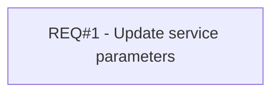

# PCG-71 Update definition of service to allow switching it OFF and ON (CBL-27)

- **Diagram Type**: Custom
- **Package**: HomerSelect/BSL/Requirements Model/Finished/PCG/PCG-71 Update definition of service to allow switching it OFF and ON (CBL-27)
- **Diagram ID**: 103217
- **Elements**: 1
- **Connectors**: 0

