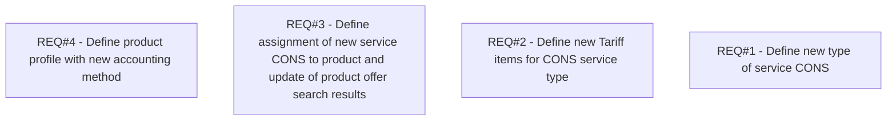

# PCG-72 Consolidation CEL (Top-Up for IN)(CBL-29)

```mermaid
graph TD
    REQ_4_Define_product_profile_with_new_accounting_method["REQ#4 - Define product profile with new accounting method"]
    REQ_3_Define_assignment_of_new_service_CONS_to_product_and_u["REQ#3 - Define assignment of new service CONS to product and update of product offer search results"]
    REQ_2_Define_new_Tariff_items_for_CONS_service_type["REQ#2 - Define new Tariff items for CONS service type"]
    REQ_1_Define_new_type_of_service_CONS["REQ#1 - Define new type of service CONS"]
```
