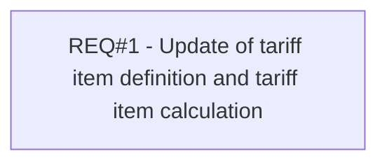

# PCG-74 New algorithm for penalty calculation (CBL-46)

- **Diagram Type**: Custom
- **Package**: HomerSelect/BSL/Requirements Model/Finished/PCG/PCG-74 New algorithm for penalty calculation (CBL-46)
- **Diagram ID**: 103178
- **Elements**: 1
- **Connectors**: 0

