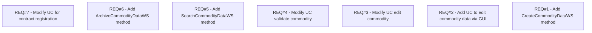

# PCG-76 Division of BSL - Commodity Module (CBL-31)

```mermaid
graph TD
    REQ_7_Modify_UC_for_contract_registration["REQ#7 - Modify UC for contract registration"]
    REQ_6_Add_ArchiveCommodityDataWS_method["REQ#6 - Add ArchiveCommodityDataWS method"]
    REQ_5_Add_SearchCommodityDataWS_method["REQ#5 - Add SearchCommodityDataWS method"]
    REQ_4_Modify_UC_validate_commodity["REQ#4 - Modify UC validate commodity"]
    REQ_3_Modify_UC_edit_commodity["REQ#3 - Modify UC edit commodity"]
    REQ_2_Add_UC_to_edit_commodity_data_via_GUI["REQ#2 - Add UC to edit commodity data via GUI"]
    REQ_1_Add_CreateCommodityDataWS_method["REQ#1 - Add CreateCommodityDataWS method"]
```
