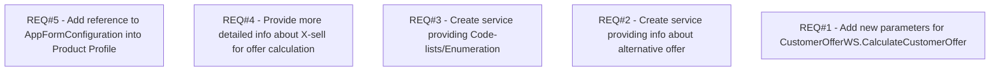

# PCG-78 Eshop phase 3 (CBL-36)

```mermaid
graph TD
    REQ_5_Add_reference_to_AppFormConfiguration_into_Product_Pro["REQ#5 - Add reference to AppFormConfiguration into Product Profile"]
    REQ_4_Provide_more_detailed_info_about_X_sell_for_offer_calc["REQ#4 - Provide more detailed info about X-sell for offer calculation"]
    REQ_3_Create_service_providing_Code_lists_Enumeration["REQ#3 - Create service providing Code-lists/Enumeration"]
    REQ_2_Create_service_providing_info_about_alternative_offer["REQ#2 - Create service providing info about alternative offer"]
    REQ_1_Add_new_parameters_for_CustomerOfferWS_CalculateCustom["REQ#1 - Add new parameters for CustomerOfferWS.CalculateCustomerOffer"]
```
