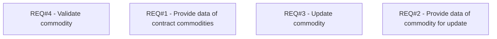

# PCG-79 Eshop API - interface for Commodity (CBL-52)

- **Diagram Type**: Custom
- **Package**: HomerSelect/BSL/Requirements Model/Finished/PCG/PCG-79 Eshop API - interface for Commodity (CBL-52)
- **Diagram ID**: 103145
- **Elements**: 4
- **Connectors**: 0

