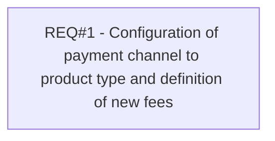

# PCG-80 Direct Debit for REL (CBL-50)

- **Diagram Type**: Custom
- **Package**: HomerSelect/BSL/Requirements Model/Finished/PCG/PCG-80 Direct Debit for REL (CBL-50)
- **Diagram ID**: 103140
- **Elements**: 1
- **Connectors**: 0

