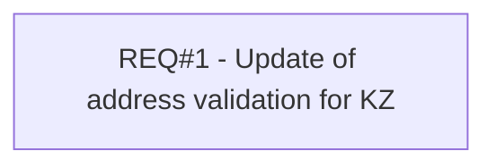

# PCG-90 New ZIP code (CBL-41)

- **Diagram Type**: Custom
- **Package**: HomerSelect/BSL/Requirements Model/Finished/PCG/PCG-90 New ZIP code (CBL-41)
- **Diagram ID**: 103172
- **Elements**: 1
- **Connectors**: 0

