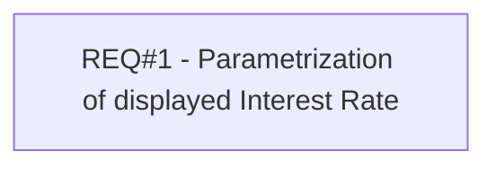

# PCG-93 Displaying of Monthly Interest Rate (CBL-20)

- **Diagram Type**: Custom
- **Package**: HomerSelect/BSL/Requirements Model/Finished/PCG/PCG-93 Displaying of Monthly Interest Rate (CBL-20)
- **Diagram ID**: 103182
- **Elements**: 1
- **Connectors**: 0

