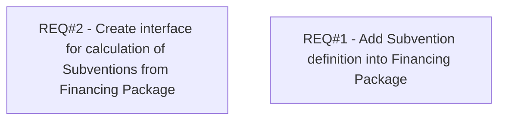

# PCG-938 Financing Scheme IV - REL subventions

- **Diagram Type**: Custom
- **Package**: HomerSelect/BSL/Requirements Model/Finished/PCG/PCG-938 Financing Scheme IV - REL subventions (CBL-2621)
- **Diagram ID**: 103594
- **Elements**: 2
- **Connectors**: 0

