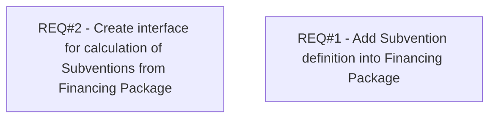

# PCG-938 Financing Scheme IV - REL subventions

```mermaid
graph TD
    REQ_2_Create_interface_for_calculation_of_Subventions_from_F["REQ#2 - Create interface for calculation of Subventions from Financing Package"]
    REQ_1_Add_Subvention_definition_into_Financing_Package["REQ#1 - Add Subvention definition into Financing Package"]
```
