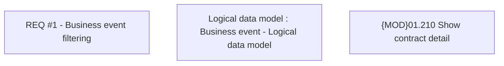

# CBL-21155 (CLM-6898) Business event list filtering according to privilege

- **Diagram Type**: Custom
- **Package**: HomerSelect/BSL/Requirements Model/In process/CLM/CBL-21155 (CLM-6898) Business event list filtering according to privilege
- **Diagram ID**: 161260
- **Elements**: 3
- **Connectors**: 0

