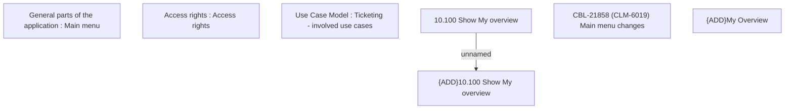

# CBL-21858 (CLM-6019) Main menu changes

- **Diagram Type**: Custom
- **Package**: HomerSelect/BSL/Requirements Model/In process/CLM/CBL-21858 (CLM-6019) Main menu changes
- **Diagram ID**: 156890
- **Elements**: 7
- **Connectors**: 1

