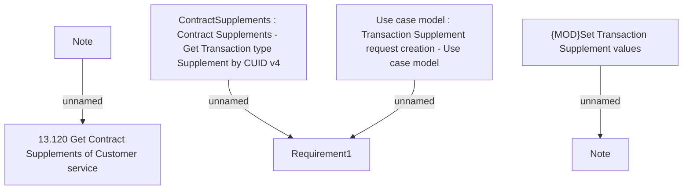

# CBL-22675 (CLM-5768) BNPL Supplement with Commodity data for Loan Purpose

- **Diagram Type**: Custom
- **Package**: HomerSelect/BSL/Requirements Model/In process/CLM/CBL-22675 (CLM-5768) BNPL Supplement with Commodity data for Loan Purpose
- **Diagram ID**: 157347
- **Elements**: 7
- **Connectors**: 4

