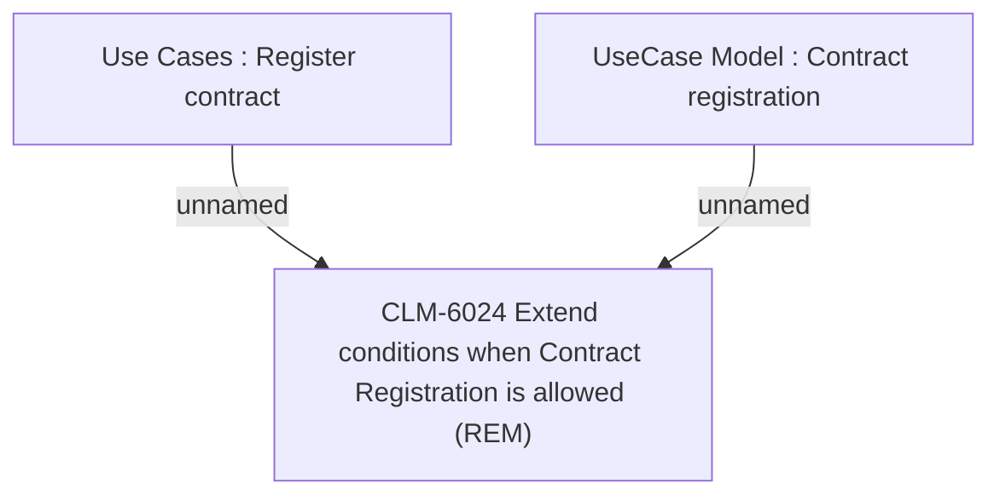

# CBL-22844 (CLM-5856) DDM flag-Blacklisted & Re-used Registration to be disabled across all products

- **Diagram Type**: Custom
- **Package**: HomerSelect/BSL/Requirements Model/In process/CLM/CBL-22844 (CLM-5856) Repayment bank account number flag-Blacklisted & Re-used Registration to be disabled across all products
- **Diagram ID**: 157001
- **Elements**: 3
- **Connectors**: 2

