# CBL-23168 (CLM-5891) [VAS] Standalone PPI as a second loan

- **Diagram Type**: Custom
- **Package**: HomerSelect/BSL/Requirements Model/In process/CLM/CBL-23168 (CLM-5891) [VAS] Standalone PPI as a second loan
- **Diagram ID**: 156633
- **Elements**: 45
- **Connectors**: 17

```mermaid
graph TD
    MOD_01_715_Finish_contract_automatically["{MOD}01.715 Finish contract automatically"]
    MOD_01_700_Choose_contracts_suitable_to_finishing["{MOD}01.700 Choose contracts suitable to finishing"]
    MOD_01_279_Choose_contracts_suitable_to_registration_and_fin["{MOD}01.279 Choose contracts suitable to registration and finishing"]
    n_01_711_Accept_conditions_for_SAI_contract["01.711 Accept conditions for SAI contract"]
    DEL_01_252_Evaluate_Contract_Service_Parameters["{DEL}01.252 Evaluate Contract Service Parameters"]
    CLM_6027_Update_COP_processing_for_Standalone_PPI_CLM_6027_U["CLM-6027 Update COP processing for Standalone PPI : CLM-6027 Update COP processing for Standalone PPI"]
    CLM_6027_Update_COP_processing_for_Standalone_PPI["CLM-6027 Update COP processing for Standalone PPI"]
    Early_repayment_of_SAI_contract["Early repayment of SAI contract"]
    Cancel_SAI_within_Cooling_off_period["Cancel SAI within Cooling-off period"]
    Finishing_of_SAI_with_installment_on_customer_request["Finishing of SAI with installment on customer request"]
    CLM_6021_Cancellation_of_SAI_with_installments["CLM-6021 Cancellation of SAI with installments"]
    User["User"]
    Assemble_Termination_Message_for_Information_area["Assemble Termination Message for Information area"]
    CBL_16453_CSI_2123_Change_the_calculation_of_refunding_fee_w["CBL-16453 (CSI-2123) Change the calculation of refunding fee when customer ET : CBL-16453 (CSI-2123) Change the calculation of refunding fee when customer ET"]
    MOD_Calculate_new_installment_amount_on_service_termination["{MOD}Calculate new installment amount on service termination"]
    n_08_454_Terminate_contract_insurance_service["08.454 Terminate contract insurance service"]
    n_08_453_Get_Contract_insurance_Terminate_preview_service["08.453 Get Contract insurance Terminate preview service"]
    n_11_121_Terminate_insurance_contract_manually["11.121 Terminate insurance contract manually"]
    n_08_490_Terminate_Contract_Service_externally["08.490 Terminate Contract Service externally"]
    MOD_Check_conditions_to_insurance_termination["{MOD}Check conditions to insurance termination"]
    CLM_5981_Termination_of_the_SAI_with_installments["CLM-5981 Termination of the SAI with installments"]
    CLM_5982_Condition_accepted_of_SAI_with_installments["CLM-5982 Condition accepted of SAI with installments"]
    CLM_5978_Automatic_registration_SAI_contract_with_installmen["CLM-5978 Automatic registration SAI contract with installments"]
    SAI_features["SAI features"]
    MOD_Register_contract_automatically["{MOD}Register contract automatically"]
    MOD_08_121_Terminate_contract_insurance_common["{MOD}08.121 Terminate contract insurance common"]
    n_08_111_Cancel_contract_insurance_common["08.111 Cancel contract insurance common"]
    n_01_270_Register_contract_manually["01.270 Register contract manually"]
    MOD_Process_ContractRegistrationSE["{MOD}Process ContractRegistrationSE"]
    MOD_Process_LoanServiceRequestExecutedSE["{MOD}Process LoanServiceRequestExecutedSE"]
    n_01_333_Cancel_active_contract_service["01.333 Cancel active contract service"]
    n_01_590_Cancel_active_contract_manually["01.590 Cancel active contract manually"]
    n_01_332_Cancel_signed_contract_service["01.332 Cancel signed contract service"]
    n_01_330_Cancel_signed_contract_manually["01.330 Cancel signed contract manually"]
    MOD_01_210_Show_contract_detail["{MOD}01.210 Show contract detail"]
    n_01_730_Finish_contract_manually["01.730 Finish contract manually"]
    MOD_01_720_Reactivate_finished_contracts["{MOD}01.720 Reactivate finished contracts"]
    MOD_Check_conditions_to_contract_service_termination["{MOD}Check conditions to contract service termination"]
    Check_conditions_to_contract_service_cancellation["Check conditions to contract service cancellation"]
    MOD_Check_conditions_to_insurance_cancellation["{MOD}Check conditions to insurance cancellation"]
    SAI_registration["SAI registration"]
    SAI_finishing["SAI finishing"]
    ADD_03_032_Perform_insurance_termination_for_SAI_contract["{ADD}03.032 Perform insurance termination for SAI contract"]
    SAI_condition_accepted["SAI condition accepted"]
    el_1805090["Boundary"]
    CLM_6027_Update_COP_processing_for_Standalone_PPI_CLM_6027_U -->|unnamed| CLM_6027_Update_COP_processing_for_Standalone_PPI
    n_08_453_Get_Contract_insurance_Terminate_preview_service -->|unnamed| MOD_Check_conditions_to_insurance_termination
    n_08_453_Get_Contract_insurance_Terminate_preview_service -->|unnamed| MOD_Calculate_new_installment_amount_on_service_termination
    n_11_121_Terminate_insurance_contract_manually -->|unnamed| MOD_08_121_Terminate_contract_insurance_common
    n_11_121_Terminate_insurance_contract_manually -->|unnamed| Assemble_Termination_Message_for_Information_area
    n_11_121_Terminate_insurance_contract_manually -->|unnamed| MOD_Calculate_new_installment_amount_on_service_termination
    n_11_121_Terminate_insurance_contract_manually -->|unnamed| MOD_Check_conditions_to_insurance_termination
    n_08_454_Terminate_contract_insurance_service -->|unnamed| MOD_Check_conditions_to_insurance_termination
    n_08_454_Terminate_contract_insurance_service -->|unnamed| MOD_08_121_Terminate_contract_insurance_common
    n_01_330_Cancel_signed_contract_manually -->|unnamed| MOD_01_210_Show_contract_detail
    n_01_330_Cancel_signed_contract_manually -->|unnamed| User
    n_01_590_Cancel_active_contract_manually -->|unnamed| MOD_01_210_Show_contract_detail
    n_01_590_Cancel_active_contract_manually -->|unnamed| User
    User -->|unnamed| n_01_270_Register_contract_manually
    User -->|unnamed| MOD_01_210_Show_contract_detail
    User -->|unnamed| n_11_121_Terminate_insurance_contract_manually
    User -->|unnamed| n_01_730_Finish_contract_manually
```

