# CLM-6037 - BSL - Contract cancellation update

- **Diagram Type**: Custom
- **Package**: HomerSelect/BSL/Requirements Model/In process/CLM/CBL-23420 (CLM-5952) [VAS] Standalone PPI as a second loan_Prior 2/CLM-6037 - BSL - Contract cancellation update
- **Diagram ID**: 156889
- **Elements**: 14
- **Connectors**: 5

```mermaid
graph TD
    MOD_08_257_Create_Cooling_off_period_request["{MOD}08.257 Create Cooling-off period request"]
    BSL["BSL"]
    COMA["COMA"]
    n_01_740_Process_notification_about_credit_account_closure["01.740 Process notification about credit account closure "]
    n_01_445_Cancel_undisbursed_contract["01.445 Cancel undisbursed contract"]
    n_01_360_Cancel_contract["01.360 Cancel contract"]
    n_01_333_Cancel_active_contract_service["01.333 Cancel active contract service"]
    n_01_332_Cancel_signed_contract_service["01.332 Cancel signed contract service"]
    n_01_590_Cancel_active_contract_manually["01.590 Cancel active contract manually"]
    n_01_330_Cancel_signed_contract_manually["01.330 Cancel signed contract manually"]
    n_01_592_Cancel_paid_off_contract_manually["01.592 Cancel paid-off contract manually"]
    Contract_cancellation_process_update["Contract cancellation process update"]
    Process_ContractCancelled["Process ContractCancelled"]
    Process_ContractCancellationSE["Process ContractCancellationSE"]
    BSL -->|unnamed| Process_ContractCancelled
    Process_ContractCancelled -->|unnamed| Process_ContractCancellationSE
    Process_ContractCancelled -->|unnamed| COMA
    n_01_740_Process_notification_about_credit_account_closure -->|only for application| n_01_360_Cancel_contract
    MOD_08_257_Create_Cooling_off_period_request -->|unnamed| n_01_360_Cancel_contract
```

