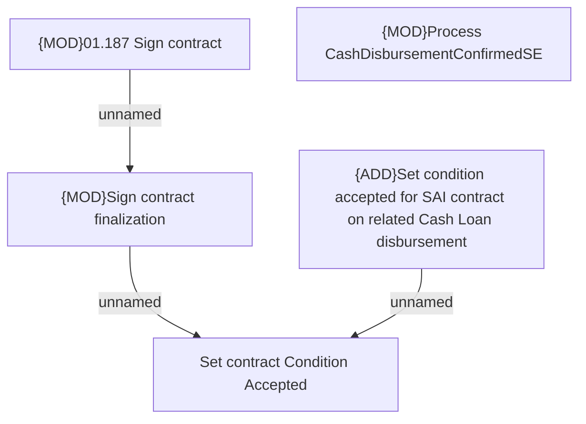

# CLM-6205 Condition accepted for related SAI contract

- **Diagram Type**: Custom
- **Package**: HomerSelect/BSL/Requirements Model/In process/CLM/CBL-23420 (CLM-5952) [VAS] Standalone PPI as a second loan_Prior 2/CLM-6205 Condition accepted for related SAI update
- **Diagram ID**: 157602
- **Elements**: 5
- **Connectors**: 3

