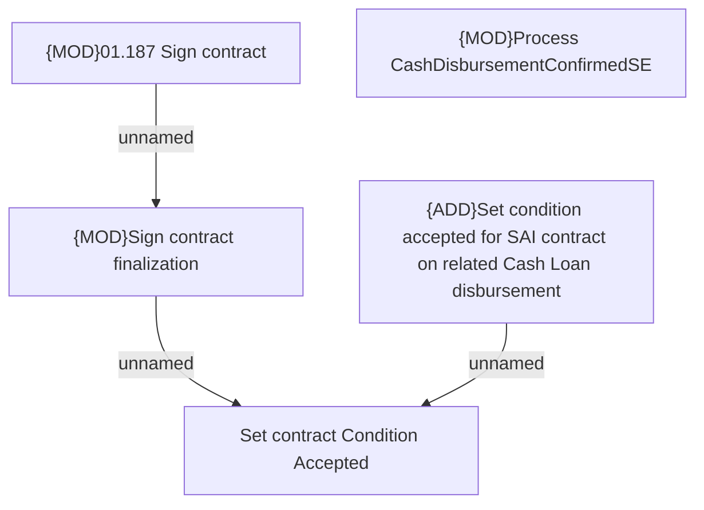

# CLM-6205 Condition accepted for related SAI contract

```mermaid
graph TD
    MOD_01_187_Sign_contract["{MOD}01.187 Sign contract"]
    ADD_Set_condition_accepted_for_SAI_contract_on_related_Cash_["{ADD}Set condition accepted for SAI contract on related Cash Loan disbursement"]
    MOD_Process_CashDisbursementConfirmedSE["{MOD}Process CashDisbursementConfirmedSE"]
    Set_contract_Condition_Accepted["Set contract Condition Accepted"]
    MOD_Sign_contract_finalization["{MOD}Sign contract finalization"]
    MOD_01_187_Sign_contract -->|unnamed| MOD_Sign_contract_finalization
    MOD_Sign_contract_finalization -->|unnamed| Set_contract_Condition_Accepted
    ADD_Set_condition_accepted_for_SAI_contract_on_related_Cash_ -->|unnamed| Set_contract_Condition_Accepted
```
