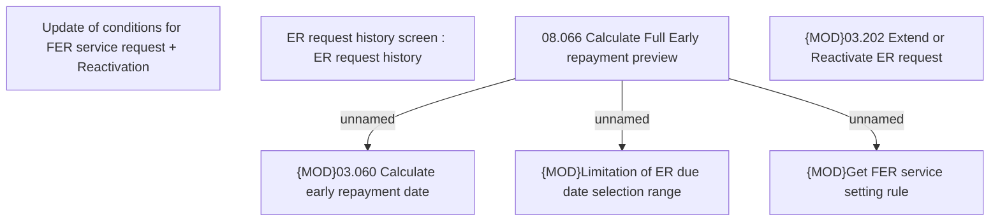

# CBL-23535 (CLM-6055) Update of conditions for FER service request

```mermaid
graph TD
    Update_of_conditions_for_FER_service_request_Reactivation["Update of conditions for FER service request + Reactivation"]
    ER_request_history_screen_ER_request_history["ER request history screen : ER request history"]
    n_08_066_Calculate_Full_Early_repayment_preview["08.066 Calculate Full Early repayment preview"]
    MOD_03_202_Extend_or_Reactivate_ER_request["{MOD}03.202 Extend or Reactivate ER request"]
    MOD_Limitation_of_ER_due_date_selection_range["{MOD}Limitation of ER due date selection range"]
    MOD_Get_FER_service_setting_rule["{MOD}Get FER service setting rule"]
    MOD_03_060_Calculate_early_repayment_date["{MOD}03.060 Calculate early repayment date"]
    n_08_066_Calculate_Full_Early_repayment_preview -->|unnamed| MOD_03_060_Calculate_early_repayment_date
    n_08_066_Calculate_Full_Early_repayment_preview -->|unnamed| MOD_Limitation_of_ER_due_date_selection_range
    n_08_066_Calculate_Full_Early_repayment_preview -->|unnamed| MOD_Get_FER_service_setting_rule
```
