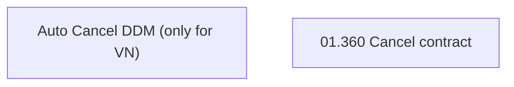

# CBL-24910 (CLM-6463) Auto cancel DDM when contract is cancelled

- **Diagram Type**: Custom
- **Package**: HomerSelect/BSL/Requirements Model/In process/CLM/CBL-24910 (CLM-6463) Auto cancel DDM when contract is cancelled
- **Diagram ID**: 159658
- **Elements**: 2
- **Connectors**: 0

