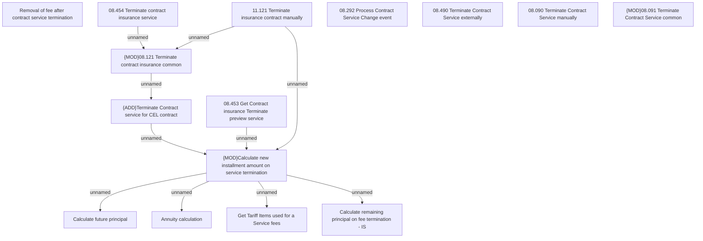

# CBL-25867 (CSI-3602) Removal of fee after contract service termination

```mermaid
graph TD
    ADD_Terminate_Contract_service_for_CEL_contract["{ADD}Terminate Contract service for CEL contract
"]
    Removal_of_fee_after_contract_service_termination["Removal of fee after contract service termination"]
    n_08_453_Get_Contract_insurance_Terminate_preview_service["08.453 Get Contract insurance Terminate preview service"]
    n_08_454_Terminate_contract_insurance_service["08.454 Terminate contract insurance service"]
    n_11_121_Terminate_insurance_contract_manually["11.121 Terminate insurance contract manually"]
    n_08_292_Process_Contract_Service_Change_event["08.292 Process Contract Service Change event"]
    n_08_490_Terminate_Contract_Service_externally["08.490 Terminate Contract Service externally"]
    n_08_090_Terminate_Contract_Service_manually["08.090 Terminate Contract Service manually"]
    MOD_08_091_Terminate_Contract_Service_common["{MOD}08.091 Terminate Contract Service common"]
    Calculate_future_principal["Calculate future principal"]
    Annuity_calculation["Annuity calculation"]
    Get_Tariff_Items_used_for_a_Service_fees["Get Tariff Items used for a Service fees"]
    MOD_08_121_Terminate_contract_insurance_common["{MOD}08.121 Terminate contract insurance common"]
    MOD_Calculate_new_installment_amount_on_service_termination["{MOD}Calculate new installment amount on service termination"]
    Calculate_remaining_principal_on_fee_termination_IS["Calculate remaining principal on fee termination - IS"]
    MOD_Calculate_new_installment_amount_on_service_termination -->|unnamed| Calculate_future_principal
    MOD_Calculate_new_installment_amount_on_service_termination -->|unnamed| Annuity_calculation
    MOD_Calculate_new_installment_amount_on_service_termination -->|unnamed| Get_Tariff_Items_used_for_a_Service_fees
    ADD_Terminate_Contract_service_for_CEL_contract -->|unnamed| MOD_Calculate_new_installment_amount_on_service_termination
    MOD_Calculate_new_installment_amount_on_service_termination -->|unnamed| Calculate_remaining_principal_on_fee_termination_IS
    n_08_453_Get_Contract_insurance_Terminate_preview_service -->|unnamed| MOD_Calculate_new_installment_amount_on_service_termination
    n_11_121_Terminate_insurance_contract_manually -->|unnamed| MOD_08_121_Terminate_contract_insurance_common
    n_11_121_Terminate_insurance_contract_manually -->|unnamed| MOD_Calculate_new_installment_amount_on_service_termination
    n_08_454_Terminate_contract_insurance_service -->|unnamed| MOD_08_121_Terminate_contract_insurance_common
    MOD_08_121_Terminate_contract_insurance_common -->|unnamed| ADD_Terminate_Contract_service_for_CEL_contract
```
