# CBL-25926 (CSI-3619) BNPL - transaction confirmation - change integration to async mode

- **Diagram Type**: Custom
- **Package**: HomerSelect/BSL/Requirements Model/In process/CLM/CBL-25926 (CSI-3619) BNPL - transaction confirmation - change integration to async mode
- **Diagram ID**: 159783
- **Elements**: 14
- **Connectors**: 6

```mermaid
graph TD
    External_Reference["External Reference"]
    el_1834617["Note"]
    Req_1_BNPL_transaction_confirmation_change_integration_to_as["Req #1: BNPL - transaction confirmation - change integration to async mode"]
    el_1834616["Note"]
    MOD_Create_Confirm_Transaction_Request_for_AM["{MOD}Create Confirm Transaction Request for AM"]
    ADD_13_128_Process_transaction_confirmation_response["{ADD}13.128 Process transaction confirmation response"]
    Cancel_authorized_transactions_in_Transaction_Supplement["Cancel authorized transactions in Transaction Supplement"]
    Call_Transaction_confirmation_REST_in_AM["Call Transaction confirmation (REST) in AM"]
    Validate_Transaction_Supplement_update_request["Validate Transaction Supplement update request"]
    Logical_data_model_Transaction_Supplement_domain_Logical_dat["Logical data model : Transaction Supplement domain - Logical data model"]
    n_13_112_Refund_Transaction_Supplement["13.112 Refund Transaction Supplement"]
    n_13_104_Cancel_Transaction_Supplement_service["13.104 Cancel Transaction Supplement service"]
    MOD_13_114_Process_transaction_cancellation_request["{MOD}13.114 Process transaction cancellation request"]
    MOD_13_110_Process_account_transaction_for_Transaction_Suppl["{MOD}13.110 Process account transaction for Transaction Supplement"]
    MOD_13_110_Process_account_transaction_for_Transaction_Suppl -->|unnamed| MOD_Create_Confirm_Transaction_Request_for_AM
    MOD_13_110_Process_account_transaction_for_Transaction_Suppl -->|unnamed| Call_Transaction_confirmation_REST_in_AM
    n_13_104_Cancel_Transaction_Supplement_service -->|unnamed| Cancel_authorized_transactions_in_Transaction_Supplement
    n_13_112_Refund_Transaction_Supplement -->|unnamed| Validate_Transaction_Supplement_update_request
    MOD_13_114_Process_transaction_cancellation_request -->|unnamed| Call_Transaction_confirmation_REST_in_AM
    MOD_13_114_Process_transaction_cancellation_request -->|unnamed| MOD_Create_Confirm_Transaction_Request_for_AM
```

