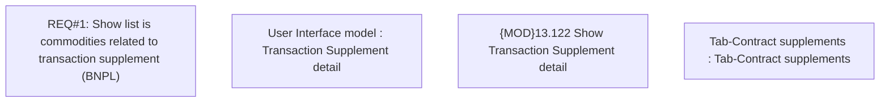

# CBL-27552 (CLM-6817) - Display Commodity list for transaction supplement

```mermaid
graph TD
    REQ_1_Show_list_is_commodities_related_to_transaction_supple["REQ#1: Show list is commodities related to transaction supplement (BNPL)"]
    User_Interface_model_Transaction_Supplement_detail["User Interface model : Transaction Supplement detail"]
    MOD_13_122_Show_Transaction_Supplement_detail["{MOD}13.122 Show Transaction Supplement detail"]
    Tab_Contract_supplements_Tab_Contract_supplements["Tab-Contract supplements : Tab-Contract supplements"]
```
