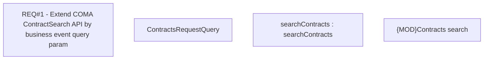

# CBL-30031 (CLM-7285) Extend COMA ContractSearch API by business event query param

- **Diagram Type**: Custom
- **Package**: HomerSelect/BSL/Requirements Model/In process/CLM/CBL-30031 (CLM-7285) Extend COMA ContractSearch API by business event query param
- **Diagram ID**: 163952
- **Elements**: 4
- **Connectors**: 0

