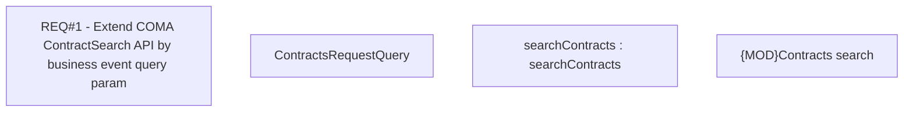

# CBL-30031 (CLM-7285) Extend COMA ContractSearch API by business event query param

```mermaid
graph TD
    REQ_1_Extend_COMA_ContractSearch_API_by_business_event_query["REQ#1 - Extend COMA ContractSearch API by business event query param"]
    ContractsRequestQuery["ContractsRequestQuery"]
    searchContracts_searchContracts["searchContracts : searchContracts"]
    MOD_Contracts_search["{MOD}Contracts search"]
```
