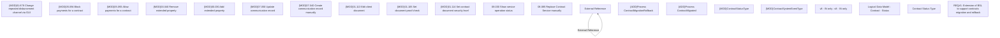

# CBL-31177 (CLM-7629) Migrated contract support

```mermaid
graph TD
    MOD_01_678_Change_repeated_disbursement_channel_via_GUI["{MOD}01.678 Change repeated disbursement channel via GUI"]
    MOD_05_094_Block_payments_for_a_contract["{MOD}05.094 Block payments for a contract"]
    MOD_05_093_Allow_payments_for_a_contract["{MOD}05.093 Allow payments for a contract"]
    MOD_00_040_Remove_extended_property["{MOD}00.040 Remove extended property"]
    MOD_00_030_Add_extended_property["{MOD}00.030 Add extended property"]
    MOD_07_050_Update_communication_record["{MOD}07.050 Update communication record"]
    MOD_07_040_Create_communication_record_manually["{MOD}07.040 Create communication record manually"]
    MOD_01_113_Edit_client_document["{MOD}01.113 Edit client document"]
    MOD_01_105_Set_document_proof_check["{MOD}01.105 Set document proof check"]
    MOD_01_114_Set_contract_document_security_level["{MOD}01.114 Set contract document security level"]
    n_08_030_Show_service_operation_status["08.030 Show service operation status"]
    n_08_085_Replace_Contract_Service_manually["08.085 Replace Contract Service manually"]
    External_Reference["External Reference"]
    External_Reference["External Reference"]
    External_Reference["External Reference"]
    External_Reference["External Reference"]
    ADD_Process_ContractMigrationRollback["{ADD}Process ContractMigrationRollback"]
    ADD_Process_ContractMigrated["{ADD}Process ContractMigrated"]
    MOD_ContractStatusType["{MOD}ContractStatusType"]
    MOD_ContractSystemEventType["{MOD}ContractSystemEventType"]
    v8_IN_only_v8_IN_only["v8 - IN only : v8 - IN only"]
    Logical_Data_Model_Contract_Status["Logical Data Model : Contract - Status"]
    Contract_Status_Type["Contract Status Type"]
    REQ_1_Extension_of_BSL_to_support_contracts_migration_and_ro["REQ#1: Extension of BSL to support contracts migration and rollback"]
    External_Reference -->|External Reference| External_Reference
    External_Reference -->|External Reference| External_Reference
```
