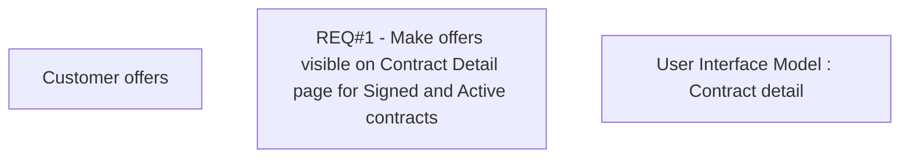

# CBL-31528 (CLM-7557) Make offers visible in Application Detail after Approval / Signing of Contract

- **Diagram Type**: Custom
- **Package**: HomerSelect/BSL/Requirements Model/In process/CLM/CBL-31528 (CLM-7557) Make offers visible in Application Detail after Approval / Signing of Contract
- **Diagram ID**: 164664
- **Elements**: 3
- **Connectors**: 0

