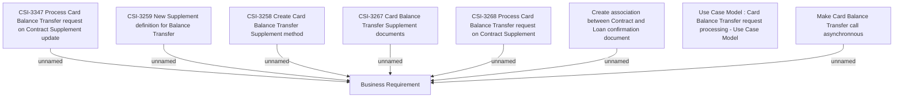

# CBL-22574 (CSI-2938) Convert CARD BALANCE to installment plan

```mermaid
graph TD
    CSI_3347_Process_Card_Balance_Transfer_request_on_Contract_S["CSI-3347 Process Card Balance Transfer request on Contract Supplement update"]
    Make_Card_Balance_Transfer_call_asynchronnous["Make Card Balance Transfer call asynchronnous"]
    Create_association_between_Contract_and_Loan_confirmation_do["Create association between Contract and Loan confirmation document"]
    CSI_3268_Process_Card_Balance_Transfer_request_on_Contract_S["CSI-3268 Process Card Balance Transfer request on Contract Supplement"]
    CSI_3267_Card_Balance_Transfer_Supplement_documents["CSI-3267 Card Balance Transfer Supplement documents"]
    CSI_3258_Create_Card_Balance_Transfer_Supplement_method["CSI-3258 Create Card Balance Transfer Supplement method"]
    Use_Case_Model_Card_Balance_Transfer_request_processing_Use_["Use Case Model : Card Balance Transfer request processing - Use Case Model"]
    CSI_3259_New_Supplement_definition_for_Balance_Transfer["CSI-3259 New Supplement definition for Balance Transfer"]
    Business_Requirement["Business Requirement"]
    CSI_3347_Process_Card_Balance_Transfer_request_on_Contract_S -->|unnamed| Business_Requirement
    CSI_3259_New_Supplement_definition_for_Balance_Transfer -->|unnamed| Business_Requirement
    CSI_3258_Create_Card_Balance_Transfer_Supplement_method -->|unnamed| Business_Requirement
    CSI_3267_Card_Balance_Transfer_Supplement_documents -->|unnamed| Business_Requirement
    CSI_3268_Process_Card_Balance_Transfer_request_on_Contract_S -->|unnamed| Business_Requirement
    Create_association_between_Contract_and_Loan_confirmation_do -->|unnamed| Business_Requirement
    Make_Card_Balance_Transfer_call_asynchronnous -->|unnamed| Business_Requirement
```
