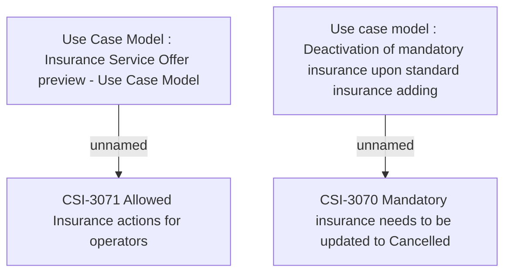

# CBL-22644 VAS as Add On to Existing Loan Contract - BSS ( CEL) - Enhancement

```mermaid
graph TD
    Use_Case_Model_Insurance_Service_Offer_preview_Use_Case_Mode["Use Case Model : Insurance Service Offer preview - Use Case Model"]
    Use_case_model_Deactivation_of_mandatory_insurance_upon_stan["Use case model : Deactivation of mandatory insurance upon standard insurance adding"]
    CSI_3071_Allowed_Insurance_actions_for_operators["CSI-3071 Allowed Insurance actions for operators"]
    CSI_3070_Mandatory_insurance_needs_to_be_updated_to_Cancelle["CSI-3070 Mandatory insurance needs to be updated to Cancelled"]
    Use_case_model_Deactivation_of_mandatory_insurance_upon_stan -->|unnamed| CSI_3070_Mandatory_insurance_needs_to_be_updated_to_Cancelle
    Use_Case_Model_Insurance_Service_Offer_preview_Use_Case_Mode -->|unnamed| CSI_3071_Allowed_Insurance_actions_for_operators
```
