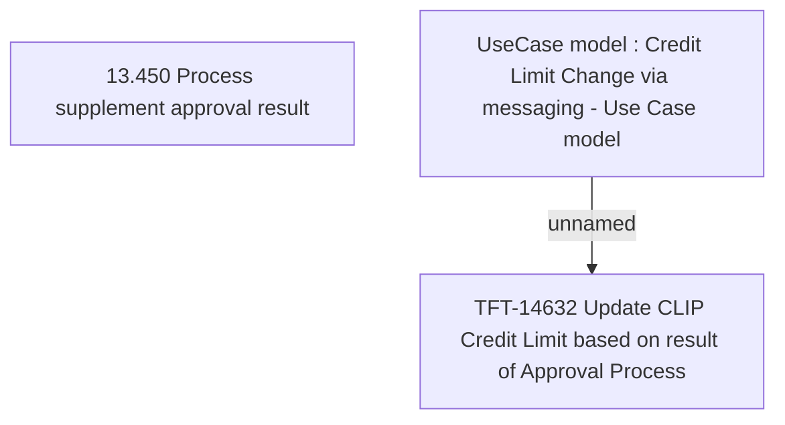

# CBL-22677 (CSI-2929) Add new LIMITSCORING phase at ORBP for CLIP process

- **Diagram Type**: Custom
- **Package**: HomerSelect/BSL/Requirements Model/In process/CSI/CBL-22677 (CSI-2929) Add new LIMITSCORING phase at ORBP for CLIP process
- **Diagram ID**: 157143
- **Elements**: 3
- **Connectors**: 1

