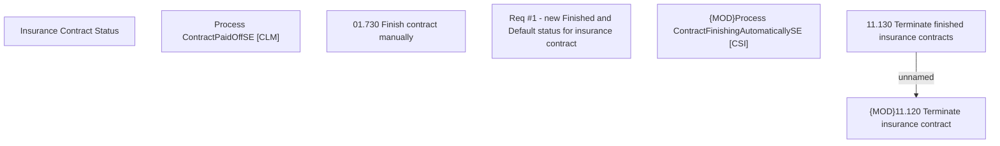

# CBL-23482 (CSI-3253) Insurance status update for PH

- **Diagram Type**: Custom
- **Package**: HomerSelect/BSL/Requirements Model/In process/CSI/CBL-23482 (CSI-3253) Insurance status update for PH
- **Diagram ID**: 157502
- **Elements**: 7
- **Connectors**: 1

