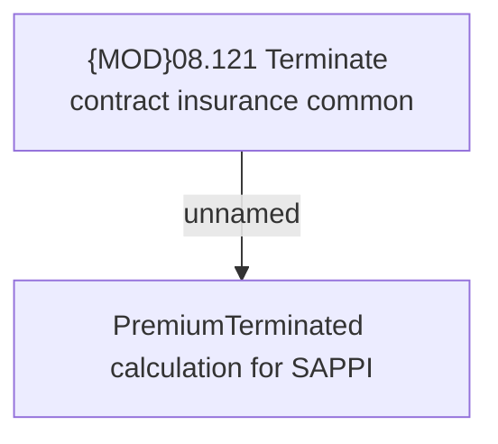

# CBL-24763 (CSI-3333) [SAPPI] Adding new calculation for the premium amount when insurance is terminated

- **Diagram Type**: Custom
- **Package**: HomerSelect/BSL/Requirements Model/In process/CSI/CBL-24763 (CSI-3333) [SAPPI] Adding new calculation for the premium amount when insurance is terminated
- **Diagram ID**: 157759
- **Elements**: 2
- **Connectors**: 1

