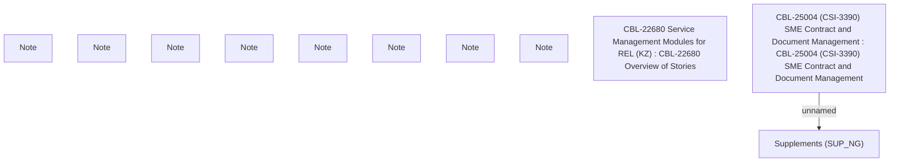

# CBL-25004 (CSI-3365) SME Contract and Document Management

```mermaid
graph TD
    el_1824158["Note"]
    el_1824154["Note"]
    el_1824150["Note"]
    el_1824157["Note"]
    el_1824149["Note"]
    el_1824156["Note"]
    el_1824152["Note"]
    el_1824155["Note"]
    CBL_22680_Service_Management_Modules_for_REL_KZ_CBL_22680_Ov["CBL-22680 Service Management Modules for REL (KZ) : CBL-22680 Overview of Stories"]
    CBL_25004_CSI_3390_SME_Contract_and_Document_Management_CBL_["CBL-25004 (CSI-3390) SME Contract and Document Management : CBL-25004 (CSI-3390) SME Contract and Document Management"]
    Supplements_SUP_NG["Supplements (SUP_NG)"]
    CBL_25004_CSI_3390_SME_Contract_and_Document_Management_CBL_ -->|unnamed| Supplements_SUP_NG
```
