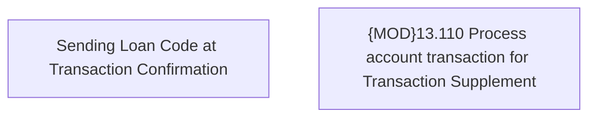

# CBL-25062 (CSI-3393) sending Loan Code at Transaction Confirmation

- **Diagram Type**: Custom
- **Package**: HomerSelect/BSL/Requirements Model/In process/CSI/CBL-25062 (CSI-3393) sending Loan Code at Transaction Confirmation
- **Diagram ID**: 158456
- **Elements**: 2
- **Connectors**: 0

