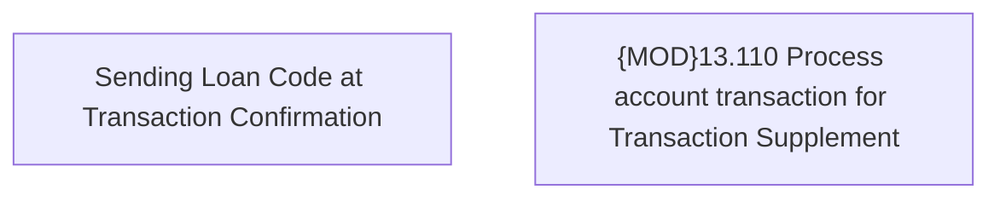

# CBL-25062 (CSI-3393) sending Loan Code at Transaction Confirmation

```mermaid
graph TD
    Sending_Loan_Code_at_Transaction_Confirmation["Sending Loan Code at Transaction Confirmation"]
    MOD_13_110_Process_account_transaction_for_Transaction_Suppl["{MOD}13.110 Process account transaction for Transaction Supplement"]
```
