# CBL-25261 (CSI-3472) Insurance Period update on Loan change

- **Diagram Type**: Custom
- **Package**: HomerSelect/BSL/Requirements Model/In process/CSI/CBL-25261 (CSI-3472) Insurance Period update on Loan change
- **Diagram ID**: 159072
- **Elements**: 11
- **Connectors**: 0

```mermaid
graph TD
    Determine_first_Insurance_Period_based_on_Insurance_paramete["Determine first Insurance Period based on Insurance parameters"]
    MOD_08_406_Process_request_for_loan_restructuring["{MOD}08.406 Process request for loan restructuring"]
    MOD_08_352_Process_LoanServiceRequestRollbackSE_event["{MOD}08.352 Process LoanServiceRequestRollbackSE event"]
    MOD_08_362_Process_payment_holiday_request["{MOD}08.362 Process payment holiday request"]
    ADD_Prolong_insurance_Period_upon_related_Loan_Contract_upda["{ADD}Prolong insurance Period upon related Loan Contract update"]
    Req_1_Insurance_Period_update_on_Loan_change["Req#1 - Insurance Period update on Loan change"]
    MOD_First_Insurance_Period_Duration["{MOD}First Insurance Period Duration"]
    MOD_11_775_Activate_Standalone_Insurance_on_Cash_Loan_disbur["{MOD}11.775 Activate Standalone Insurance on Cash Loan disbursement"]
    MOD_Determine_Insurance_Period_End_for_additionally_added_In["{MOD}Determine Insurance Period End for additionally added Insurance"]
    MOD_Check_conditions_to_insurance_termination["{MOD}Check conditions to insurance termination"]
    Determine_first_insurance_period["Determine first insurance period"]
```

