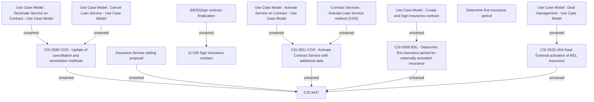

# CBL-25266 (CSI-3437) VN New insurance on card product

```mermaid
graph TD
    Use_Case_Model_Terminate_Service_on_Contract_Use_Case_Model["Use Case Model : Terminate Service on Contract - Use Case Model"]
    Use_Case_Model_Cancel_Loan_Service_Use_Case_Model["Use Case Model : Cancel Loan Service - Use Case Model"]
    CSI_3580_COS_Update_of_cancellation_and_termination_methods["CSI-3580 COS - Update of cancellation and termination methods"]
    Contract_Services_Activate_Loan_Service_method_COS["Contract Services : Activate Loan Service method (COS)"]
    CSI_3551_COS_Activate_Contract_Service_with_additional_data["CSI-3551 COS - Activate Contract Service with additional data"]
    Use_Case_Model_Activate_Service_on_Contract_Use_Case_Model["Use Case Model : Activate Service on Contract - Use Case Model"]
    Use_Case_Model_Deal_management_Use_Case_Model["Use Case Model : Deal management - Use Case Model"]
    n_11_030_Sign_insurance_contract["11.030 Sign insurance contract"]
    MOD_Sign_contract_finalization["{MOD}Sign contract finalization"]
    Determine_first_insurance_period["Determine first insurance period"]
    CSI_3568_BSL_Determine_first_insurance_period_for_externally["CSI-3568 BSL - Determine first insurance period for externally activated insurance"]
    Use_Case_Model_Create_and_Sign_Insurance_contract["Use Case Model : Create and Sign Insurance contract"]
    CSI_3533_VAS_Deal_External_activation_of_REL_insurance["CSI-3533 VAS-Deal External activation of REL insurance"]
    Insurance_Service_setting_proposal["Insurance Service setting proposal"]
    CSI_3437["CSI-3437"]
    CSI_3580_COS_Update_of_cancellation_and_termination_methods -->|unnamed| CSI_3437
    Insurance_Service_setting_proposal -->|unnamed| CSI_3437
    CSI_3551_COS_Activate_Contract_Service_with_additional_data -->|unnamed| CSI_3437
    CSI_3568_BSL_Determine_first_insurance_period_for_externally -->|unnamed| CSI_3437
    CSI_3533_VAS_Deal_External_activation_of_REL_insurance -->|unnamed| CSI_3437
    Use_Case_Model_Deal_management_Use_Case_Model -->|unnamed| CSI_3533_VAS_Deal_External_activation_of_REL_insurance
    Use_Case_Model_Create_and_Sign_Insurance_contract -->|unnamed| CSI_3568_BSL_Determine_first_insurance_period_for_externally
    Use_Case_Model_Activate_Service_on_Contract_Use_Case_Model -->|unnamed| CSI_3551_COS_Activate_Contract_Service_with_additional_data
    Contract_Services_Activate_Loan_Service_method_COS -->|unnamed| CSI_3551_COS_Activate_Contract_Service_with_additional_data
    Use_Case_Model_Terminate_Service_on_Contract_Use_Case_Model -->|unnamed| CSI_3580_COS_Update_of_cancellation_and_termination_methods
    Use_Case_Model_Cancel_Loan_Service_Use_Case_Model -->|unnamed| CSI_3580_COS_Update_of_cancellation_and_termination_methods
    MOD_Sign_contract_finalization -->|unnamed| n_11_030_Sign_insurance_contract
```
