# CBL-26066 Add Insurances to Existing Contract in POS Loan and Cash Loan

- **Diagram Type**: Custom
- **Package**: HomerSelect/BSL/Requirements Model/In process/CSI/CBL-26066 Add Insurances and Services to Existing Contract in POS Loan and Cash Loan
- **Diagram ID**: 159655
- **Elements**: 48
- **Connectors**: 45

```mermaid
graph TD
    Use_Case_Model_Insurance_Service_Offers_Use_Case_Model["Use Case Model : Insurance Service Offers - Use Case Model"]
    Use_Case_Model_Insurance_Service_Offers_Use_Case_Model["Use Case Model : Insurance Service Offers - Use Case Model"]
    Use_Case_Model_Adding_Insurance_Service_on_CEL_contract["Use Case Model : Adding Insurance Service on CEL contract"]
    E5_Insurance_Offer_preview_update_extension_for_more_insuran["E5. Insurance Offer preview update - extension for more insurances calculation"]
    E8_Involve_the_new_fee_calculation_bases_into_installments_c["E8. Involve the new fee calculation bases into installments calculation"]
    BSL_Insurance_tab_update_showed_information_commodity_info["BSL Insurance tab - update showed information (commodity info)"]
    E13_Business_Events_add_new_business_events_creation_into_re["E13. Business Events - add new business events creation into respective required status changes with info about Insurance"]
    E12_Cancellation_API_update_support_multiple_Insurances_canc["E12. Cancellation API update -support multiple Insurances cancellation"]
    E11_Activate_insurance_service_API_support_multiple_Insuranc["E11. Activate insurance service API - support multiple Insurances activation"]
    E10_Add_insurance_service_API_Add_Multiple_Insurance_and_ser["E10. Add insurance service API - Add Multiple Insurance and services within one request"]
    E9_A_new_function_validation_of_customer_request_and_bulk_ca["E9. A new function - validation of customer request and bulk cancellation of insurances in NEW status"]
    E6_Create_Update_Remove_commodity_function_for_Insurance_off["E6. Create, Update, Remove commodity function for Insurance offer UI"]
    E4_A_new_function_for_BSL_Contract_detail_UI_BE_for_replacem["E4. A new function for BSL Contract detail UI/BE for replacement of the current 'Add insurance' button"]
    E7_Extend_offer_preview_API_for_returning_more_insurances["E7. Extend offer preview API for returning more insurances"]
    E3_A_new_UI_screen_for_Insurance_offer_preview["E3. A new UI (screen) for Insurance offer preview"]
    E2_Insurance_Offer_generation_update_extension_for_more_insu["E2. Insurance Offer generation update - extension for more insurances offering and adding new validation/eligibility rules"]
    E1_Extend_prc_service_offers_API_to_provide_list_of_insuranc["E1. Extend prc/service-offers API to provide list of insurances for offering"]
    el_1833626["Note"]
    el_1833620["Note"]
    el_1833611["Note"]
    el_1833619["Note"]
    el_1833618["Note"]
    el_1833610["Note"]
    el_1833617["Note"]
    el_1833615["Note"]
    el_1833612["Note"]
    el_1833613["Note"]
    el_1833622["Note"]
    el_1833616["Note"]
    el_1833621["Note"]
    n_7_BSL_VAS_addon_history_at_additional_protection_tabs_serv["7. BSL VAS addon history at additional protection tabs/services tabs or business event history info "]
    n_6_Required_API_that_could_be_used_by_local_team["6. Required API that could be used by local team"]
    n_5_3_Able_to_differentiate_the_offer_of_vas_add_on_INSGO_be["5.3. Able to differentiate the offer of vas add on INSGO between Contract POS with eligible commodity and non-eligible commodity "]
    n_5_2_Able_to_adjust_list_of_eligible_commodities["5.2. Able to adjust list of eligible commodities"]
    n_5_1_List_of_Mandatory_Data_Type_of_Gadget_Brand_of_Gadget_["5.1. List of Mandatory Data : Type of Gadget, Brand of Gadget, Model of Gadget, IMEI Number or Serial Number (refer to commodity validation rules IMEI or Serial Number)"]
    n_5_Used_Gadget_Commodity_Insurance_If_customers_decide_to_a["5. Used Gadget (Commodity) Insurance: If customers decide to add INSGO, there should be an ability to input the additional insured commodity data for customers’ used gadgets and this should be visible in BSL UI, this applies to Cash Loan and POS Loan. "]
    n_4_2_Able_to_terminate_and_cancel_Vas_Add_On_Additional_Pro["4.2. Able to terminate and cancel Vas Add On (Additional Protection and Services) with status active"]
    n_4_1_If_the_customer_has_multiple_NEW_status_of_VAS_Add_On_["4.1. If the customer has multiple NEW status of VAS Add On (Additional Protection and Services) and wants to cancel it, all VAS Add On with NEW status need to be cancelled."]
    n_4_Able_to_cancel_and_terminate_the_Vas_Add_On_insurance_fr["4. Able to cancel and terminate the Vas Add On insurance from UI and API"]
    n_3_Able_to_calculate_the_amount_of_additional_protection_ba["3. Able to calculate the amount of additional protection based on the simple principal, goods price and tenure."]
    n_1_7_Preview_the_amount_of_multiple_VAS_Add_On_UI_and_API["1.7. Preview the amount of multiple VAS Add On (UI and API)."]
    n_1_6_Consumer_local_application_can_notice_the_notification["1.6. Consumer (local application) can notice the notification if the process of adding new VAS add on(additional protection) already finished by the user (both from UI and API)."]
    n_1_5_Send_notification_via_RMQ_of_adding_new_additional_ins["1.5. Send notification via RMQ of adding new additional insurance and services."]
    n_1_4_Ability_to_add_multiple_VAS_Add_On_insurances_in_one_p["1.4. Ability to add multiple VAS Add On (insurances) in one process."]
    n_1_3_FREE_PA_mandatory_insurance_will_be_cancelled_after_VA["1.3. FREE_PA (mandatory insurance) will be cancelled after VAS add on insurance with service type INSLI status already sign or active, and the notification will be sent via RMQ."]
    n_1_2_Offer_will_appear_if_the_service_type_is_not_in_the_co["1.2. Offer will appear if the service type is not in the contract (Except service type INSLI with service code FREE_PA (mandatory insurance), offer will appear)."]
    n_1_1_Type_of_additional_protection_INSGO_INSMR_INSLI["1.1. Type of additional protection: INSGO, INSMR, INSLI"]
    n_1_Ability_to_add_additional_protection_to_active_CEL_contr["1. Ability to add additional protection to active CEL contracts (POS Loan and Cash Loan)"]
    E6_Create_Update_Remove_commodity_function_for_Insurance_off -->|unnamed| n_5_1_List_of_Mandatory_Data_Type_of_Gadget_Brand_of_Gadget_
    el_1833612 -->|unnamed| n_3_Able_to_calculate_the_amount_of_additional_protection_ba
    el_1833615 -->|unnamed| n_3_Able_to_calculate_the_amount_of_additional_protection_ba
    n_4_2_Able_to_terminate_and_cancel_Vas_Add_On_Additional_Pro -->|unnamed| n_4_Able_to_cancel_and_terminate_the_Vas_Add_On_insurance_fr
    n_4_1_If_the_customer_has_multiple_NEW_status_of_VAS_Add_On_ -->|unnamed| n_4_Able_to_cancel_and_terminate_the_Vas_Add_On_insurance_fr
    E9_A_new_function_validation_of_customer_request_and_bulk_ca -->|unnamed| n_4_1_If_the_customer_has_multiple_NEW_status_of_VAS_Add_On_
    el_1833619 -->|unnamed| n_4_2_Able_to_terminate_and_cancel_Vas_Add_On_Additional_Pro
    n_5_3_Able_to_differentiate_the_offer_of_vas_add_on_INSGO_be -->|unnamed| n_5_Used_Gadget_Commodity_Insurance_If_customers_decide_to_a
    n_5_2_Able_to_adjust_list_of_eligible_commodities -->|unnamed| n_5_Used_Gadget_Commodity_Insurance_If_customers_decide_to_a
    el_1833616 -->|unnamed| E6_Create_Update_Remove_commodity_function_for_Insurance_off
    el_1833621 -->|unnamed| n_5_1_List_of_Mandatory_Data_Type_of_Gadget_Brand_of_Gadget_
    E5_Insurance_Offer_preview_update_extension_for_more_insuran -->|unnamed| n_1_7_Preview_the_amount_of_multiple_VAS_Add_On_UI_and_API
    el_1833613 -->|unnamed| n_5_2_Able_to_adjust_list_of_eligible_commodities
    el_1833622 -->|unnamed| n_5_3_Able_to_differentiate_the_offer_of_vas_add_on_INSGO_be
    E10_Add_insurance_service_API_Add_Multiple_Insurance_and_ser -->|unnamed| n_6_Required_API_that_could_be_used_by_local_team
    E11_Activate_insurance_service_API_support_multiple_Insuranc -->|unnamed| n_6_Required_API_that_could_be_used_by_local_team
    E7_Extend_offer_preview_API_for_returning_more_insurances -->|unnamed| n_6_Required_API_that_could_be_used_by_local_team
    E12_Cancellation_API_update_support_multiple_Insurances_canc -->|unnamed| n_6_Required_API_that_could_be_used_by_local_team
    BSL_Insurance_tab_update_showed_information_commodity_info -->|unnamed| n_7_BSL_VAS_addon_history_at_additional_protection_tabs_serv
    E13_Business_Events_add_new_business_events_creation_into_re -->|unnamed| n_7_BSL_VAS_addon_history_at_additional_protection_tabs_serv
    el_1833611 -->|unnamed| E1_Extend_prc_service_offers_API_to_provide_list_of_insuranc
    n_5_1_List_of_Mandatory_Data_Type_of_Gadget_Brand_of_Gadget_ -->|unnamed| n_5_Used_Gadget_Commodity_Insurance_If_customers_decide_to_a
    E2_Insurance_Offer_generation_update_extension_for_more_insu -->|unnamed| n_1_4_Ability_to_add_multiple_VAS_Add_On_insurances_in_one_p
    n_1_5_Send_notification_via_RMQ_of_adding_new_additional_ins -->|unnamed| n_1_Ability_to_add_additional_protection_to_active_CEL_contr
    n_1_6_Consumer_local_application_can_notice_the_notification -->|unnamed| n_1_Ability_to_add_additional_protection_to_active_CEL_contr
    n_1_4_Ability_to_add_multiple_VAS_Add_On_insurances_in_one_p -->|unnamed| n_1_Ability_to_add_additional_protection_to_active_CEL_contr
    n_1_1_Type_of_additional_protection_INSGO_INSMR_INSLI -->|unnamed| n_1_Ability_to_add_additional_protection_to_active_CEL_contr
    n_1_3_FREE_PA_mandatory_insurance_will_be_cancelled_after_VA -->|unnamed| n_1_Ability_to_add_additional_protection_to_active_CEL_contr
    n_1_2_Offer_will_appear_if_the_service_type_is_not_in_the_co -->|unnamed| n_1_Ability_to_add_additional_protection_to_active_CEL_contr
    E6_Create_Update_Remove_commodity_function_for_Insurance_off -->|unnamed| n_1_1_Type_of_additional_protection_INSGO_INSMR_INSLI
    E1_Extend_prc_service_offers_API_to_provide_list_of_insuranc -->|unnamed| n_1_1_Type_of_additional_protection_INSGO_INSMR_INSLI
    E2_Insurance_Offer_generation_update_extension_for_more_insu -->|unnamed| n_1_2_Offer_will_appear_if_the_service_type_is_not_in_the_co
    E8_Involve_the_new_fee_calculation_bases_into_installments_c -->|unnamed| n_3_Able_to_calculate_the_amount_of_additional_protection_ba
    el_1833618 -->|unnamed| n_1_3_FREE_PA_mandatory_insurance_will_be_cancelled_after_VA
    E7_Extend_offer_preview_API_for_returning_more_insurances -->|unnamed| n_1_7_Preview_the_amount_of_multiple_VAS_Add_On_UI_and_API
    E1_Extend_prc_service_offers_API_to_provide_list_of_insuranc -->|unnamed| n_1_4_Ability_to_add_multiple_VAS_Add_On_insurances_in_one_p
    E4_A_new_function_for_BSL_Contract_detail_UI_BE_for_replacem -->|unnamed| n_1_4_Ability_to_add_multiple_VAS_Add_On_insurances_in_one_p
    E3_A_new_UI_screen_for_Insurance_offer_preview -->|unnamed| n_1_4_Ability_to_add_multiple_VAS_Add_On_insurances_in_one_p
    el_1833617 -->|unnamed| n_1_5_Send_notification_via_RMQ_of_adding_new_additional_ins
    el_1833617 -->|unnamed| n_1_6_Consumer_local_application_can_notice_the_notification
    E3_A_new_UI_screen_for_Insurance_offer_preview -->|unnamed| n_1_7_Preview_the_amount_of_multiple_VAS_Add_On_UI_and_API
    el_1833621 -->|unnamed| n_1_7_Preview_the_amount_of_multiple_VAS_Add_On_UI_and_API
    el_1833610 -->|unnamed| n_1_7_Preview_the_amount_of_multiple_VAS_Add_On_UI_and_API
    n_1_7_Preview_the_amount_of_multiple_VAS_Add_On_UI_and_API -->|unnamed| n_1_Ability_to_add_additional_protection_to_active_CEL_contr
    E3_A_new_UI_screen_for_Insurance_offer_preview -->|unnamed| n_1_2_Offer_will_appear_if_the_service_type_is_not_in_the_co
```

