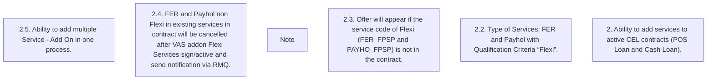

# CBL-26066 Add Services to Existing Contract in POS Loan and Cash Loan

```mermaid
graph TD
    n_2_5_Ability_to_add_multiple_Service_Add_On_in_one_process["2.5. Ability to add multiple Service - Add On in one process."]
    n_2_4_FER_and_Payhol_non_Flexi_in_existing_services_in_contr["2.4. FER and Payhol non Flexi in existing services in contract will be cancelled after VAS addon Flexi Services sign/active and send notification via RMQ."]
    el_1833624["Note"]
    n_2_3_Offer_will_appear_if_the_service_code_of_Flexi_FER_FPS["2.3. Offer will appear if the service code of Flexi (FER_FPSP and PAYHO_FPSP) is not in the contract."]
    n_2_2_Type_of_Services_FER_and_Payhol_with_Qualification_Cri["2.2. Type of Services: FER and Payhol with Qualification Criteria “Flexi”. "]
    n_2_Ability_to_add_services_to_active_CEL_contracts_POS_Loan["2. Ability to add services to active CEL contracts (POS Loan and Cash Loan)."]
```
