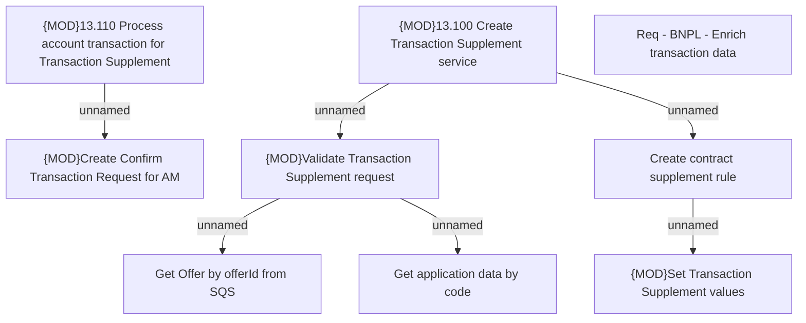

# CBL-26143 (CSI-3705) BNPL - Enrich transaction data

- **Diagram Type**: Custom
- **Package**: HomerSelect/BSL/Requirements Model/In process/CSI/CBL-26143 (CSI-3705) BNPL - Enrich transaction data
- **Diagram ID**: 160337
- **Elements**: 9
- **Connectors**: 6

