# CBL-26584 (CSI-3772) Flexible loyalty value proposition for credit card holders

- **Diagram Type**: Custom
- **Package**: HomerSelect/BSL/Requirements Model/In process/CSI/CBL-26584 (CSI-3772) Flexible loyalty value proposition for credit card holders
- **Diagram ID**: 161552
- **Elements**: 20
- **Connectors**: 0

```mermaid
graph TD
    REQ4_Extend_Add_Replace_service_and_process_AM_LRP_notificat["REQ4 - Extend Add/Replace service and process AM/LRP notifications (COS)"]
    REQ3_Process_ContractService_notification_from_COS_BSA["REQ3 - Process ContractService notification from COS (BSA)"]
    REQ2_Update_Add_Replace_service_operation_to_use_COS_for_Loy["REQ2 - Update Add/Replace service operation to use COS for Loyalty service (BSA)"]
    MOD_08_010_Add_Service_to_Loan_COS["{MOD}08.010 Add Service to Loan (COS)"]
    MOD_08_060_Replace_Loan_Service_method_COS["{MOD}08.060 Replace Loan Service method (COS)"]
    Process_ContractServiceNotification["Process ContractServiceNotification"]
    n_08_733_Execute_Replace_service_bulk_operation["08.733 Execute Replace service bulk operation"]
    n_08_723_Execute_Add_service_bulk_operation["08.723 Execute Add service bulk operation"]
    n_08_731_Create_Replace_service_bulk_operation["08.731 Create Replace service bulk operation"]
    n_08_721_Create_Add_service_bulk_operation["08.721 Create Add service bulk operation"]
    Logical_Data_Model_COMMON_Logical_Data_Model["Logical Data Model : COMMON Logical Data Model"]
    REQ1_Implement_LoanServiceRequest_reason_BSL_COS["REQ1 - Implement LoanServiceRequest reason (BSL + COS)"]
    MOD_08_220_Process_Contract_Service_operation_response["{MOD}08.220 Process Contract Service operation response"]
    n_08_294_Process_Account_response_on_Contract_Service_notifi["08.294 Process Account response on Contract Service notifications"]
    Logical_Data_Model_Logical_Data_Model["Logical Data Model : Logical Data Model"]
    Logical_Data_Model_Loan_Service_Request_domain["Logical Data Model : Loan Service Request domain"]
    Loan_Service_Requests_Loan_Service_Requests["Loan Service Requests : Loan Service Requests"]
    BSL["BSL"]
    COS["COS"]
    BSA["BSA"]
```

